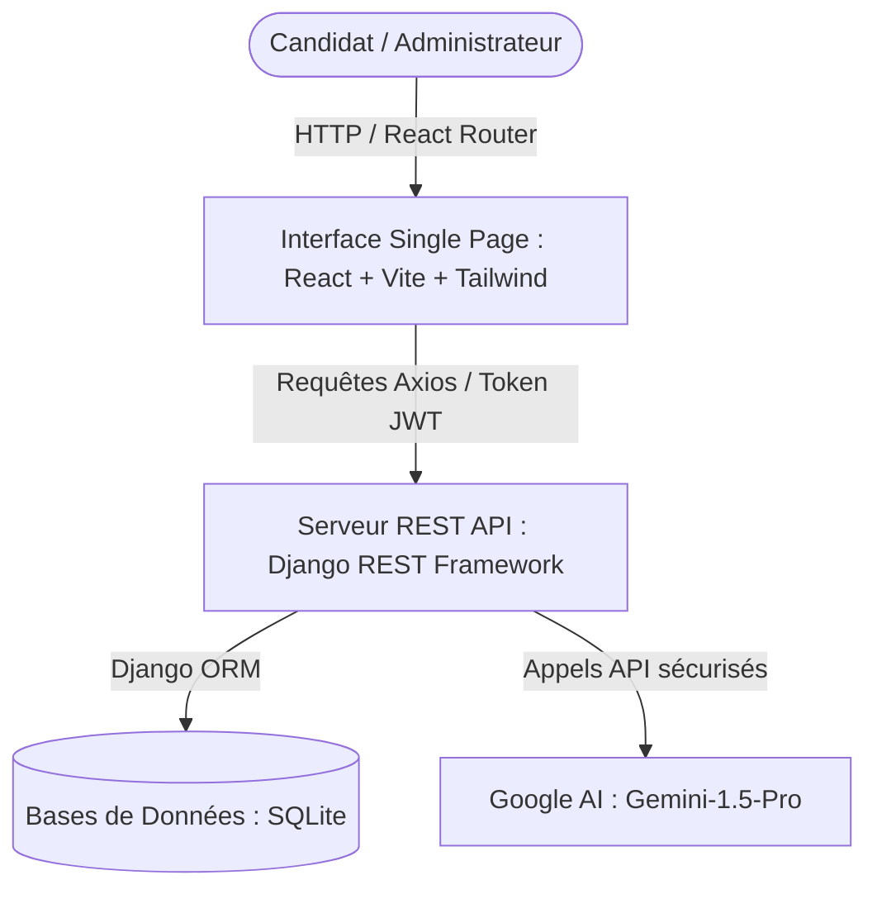
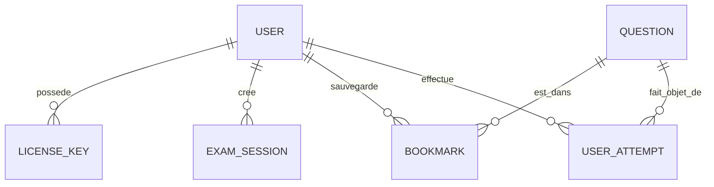

# Cahier des Charges & Spécifications Fonctionnelles
## Projet : Inforéussit — Plateforme de Préparation aux Concours Informatiques

Ce document fait office de rapport de spécifications fonctionnelles et de cahier des charges détaillé (semblable à un rapport de projet de fin d'études - PFE) pour la plateforme **Inforéussit**.

---

## 1. Contexte et Objectifs du Projet

### 1.1 Contexte
Au Maroc, l'accès aux corps de l'enseignement (CRMEF, Agrégation) ou aux postes administratifs et techniques de l'État (Ingénieurs, Techniciens, Administrateurs) requiert la réussite de concours nationaux très sélectifs. Les candidats font souvent face à une dispersion des ressources de révision (annales non corrigées, programmes officiels flous, manque d'exercices ciblés).

### 1.2 Objectifs d'Inforéussit
* **Centraliser** : Réunir 39 fiches de cours couvrant l'intégralité du programme officiel requis.
* **Corriger et Guider** : Fournir plus de 600 questions d'annales réelles (de 2018 à 2025) avec des corrections détaillées, astuces de résolution et explications pédagogiques.
* **Personnaliser grâce à l'IA** : Intégrer un assistant intelligent capable de générer des QCM sur-mesure sur des sous-domaines spécifiques pour entraîner le candidat sur ses lacunes.
* **Sécuriser et Contrôler** : Mettre en œuvre un système d'activation nominatif par clés d'accès et une limitation de crédits pour les générations d'IA.

---

## 2. Architecture Technique du Système

La plateforme adopte une architecture moderne découplée (Single Page Application) :

### 2.1 Technologies Employées
* **Frontend** : React 18, Vite (compilateur ultra-rapide), Tailwind CSS (design et mise en page responsive), Lucide React (bibliothèque d'icônes).
* **Backend** : Python 3.10+, Django 6.x, Django REST Framework (DRF) pour l'exposition des API, Simple JWT pour l'authentification sécurisée.
* **Bases de Données** : SQLite 3 (double écriture pour compatibilité avec le tableau de bord Streamlit).
* **IA** : SDK Google Generative AI (modèle `gemini-1.5-pro`).

---

## 3. Spécifications Fonctionnelles & Pages de l'Application

L'application est structurée en 10 pages clés. En voici le contenu et le rôle détaillé :

### 3.1 Page d'Accueil (`Home.jsx`)
* **Rôle** : Vitrine publique de la plateforme, orientant les visiteurs vers la connexion ou l'inscription.
* **Contenu** :
  * En-tête avec logo académique "Info Réussit".
  * Section Hero avec présentation des objectifs et illustration dynamique.
  * Section **Statistiques** (39 fiches, 600+ questions, 8 années de concours).
  * Présentation des **types de concours couverts** (CRMEF, Agrégation, Masters, Ingénieurs, Techniciens, Administrateurs).
  * Section **Nos Outils** (fiches, annales, assistant IA, carnet d'erreurs).
  * **Footer de support** avec les coordonnées administratives de l'administrateur (Rida Ouakrim).

### 3.2 Page de Connexion (`Login.jsx`)
* **Rôle** : Authentification des candidats enregistrés.
* **Contenu** :
  * Formulaire d'authentification (Nom d'utilisateur et Mot de passe).
  * Message de succès d'activation (si redirection après inscription).
  * Alertes en cas d'identifiants erronés ou compte inactif.
  * Liens vers la page d'inscription.

### 3.3 Page d'Inscription & Activation (`Register.jsx`)
* **Rôle** : Création de compte sécurisée liée à une clé d'activation obligatoire.
* **Contenu** :
  * Formulaire : Nom, Prénom, Nom d'utilisateur, Email, Mot de passe.
  * Sélection du **Concours Cible** (s'adapte au programme du candidat).
  * **Champ "Clé d'Accès Sécurisée"** : Valide l'authenticité de l'inscription via une clé d'activation générée par l'administrateur.

### 3.4 Tableau de Bord Candidat (`Dashboard.jsx`)
* **Rôle** : Hub central de suivi de progression.
* **Contenu** :
  * **Bannière d'accueil personnalisée** ("Bienvenue, [Nom] !").
  * **Indicateurs clés** :
    * Taux de fiches de cours maîtrisées (barre de progression).
    * Nombre total de questions tentées.
    * Taux de réussite global (QCM IA + Annales).
    * Nombre de questions sauvegardées dans les favoris.
  * **Section Sessions en Pause** : Permet de reprendre instantanément n'importe quel test interrompu.
  * **Diagnostic par Module (Points Faibles)** : Analyse automatique des performances par sous-domaine avec indicateur de réussite (Vert/Orange/Rouge) et lien rapide pour s'entraîner spécifiquement sur le module en difficulté.

### 3.5 Fiches de Cours (`Courses.jsx`)
* **Rôle** : Espace d'apprentissage théorique.
* **Contenu** :
  * Liste des **39 modules officiels** classés par grand domaine (Algorithmique, Système & Réseau, Architecture, Didactique, Base de Données, Génie Logiciel).
  * Moteur de recherche et filtre par domaine.
  * Visualiseur de cours intégrant le support complet de Markdown (avec syntaxe algorithmique colorée et graphiques).
  * Bouton d'auto-évaluation pour marquer un cours comme "Maîtrisé" (met à jour le Dashboard).

### 3.6 Annales et Examens Réels (`Exams.jsx`)
* **Rôle** : Entraînement en conditions réelles d'examens (2018-2025).
* **Contenu** :
  * Sélection de l'année du concours.
  * **Mode Test Actif** :
    * Affichage question par question (titre, énoncé, choix multiples A-E).
    * Support des formules mathématiques, illustrations réseaux, codes sources C/Java/SQL.
    * Option de mise en favori (Bookmark) en direct.
    * Bouton **Mettre en Pause** : Sauvegarde l'état exact (question courante, réponses données, score temporaire) pour reprise ultérieure.
    * Bouton **Terminer le test** : Soumet les réponses pour correction.
  * **Correction instantanée** : Affiche les explications détaillées, la bonne option, et les astuces pédagogiques du jury.
  * **Historique des Sessions** : Liste des examens passés avec score et taux de réussite. Possibilité de supprimer une session via une modale de confirmation personnalisée.

### 3.7 Assistant IA Générateur de QCM (`AIGenerator.jsx`)
* **Rôle** : Entraînement adaptatif à la demande.
* **Contenu** :
  * **Sélection des critères** : Domaine principal, sous-domaine précis (ex: Graphes, Adressage IP), nombre de questions (de 3 à 15), niveau de difficulté (Facile, Moyen, Difficile).
  * **Badge de Crédits** : Affiche le nombre de générations IA restantes autorisées pour l'utilisateur.
  * **Gestion de la limite (Enforce)** : Si le crédit est à `0`, le bouton de génération est remplacé par un encart rouge de contact (Rida Ouakrim) pour demander des crédits supplémentaires.
  * **Génération de QCM** : Lance une requête à l'API Gemini pour générer des questions exclusives, réalistes et calibrées.
  * **Passage & Correction** : Même ergonomie que le module Annales (reprise en pause, correction immédiate, explications détaillées).

### 3.8 Questions Favorites (`Bookmarks.jsx`)
* **Rôle** : Répertoire personnalisé des questions difficiles.
* **Contenu** :
  * Liste de toutes les questions marquées comme "favoris" par le candidat.
  * Possibilité de s'auto-évaluer directement sur ces questions.
  * Bouton de retrait rapide avec toast de confirmation.

### 3.9 Carnet d'Erreurs (`ErrorNotebook.jsx`)
* **Rôle** : Recueil automatique des échecs pour apprentissage par l'erreur.
* **Contenu** :
  * Chaque fois qu'un candidat répond faux à une question (Annales ou QCM IA), celle-ci est automatiquement insérée dans le Carnet d'Erreurs.
  * Affiche l'énoncé, la mauvaise réponse donnée, la correction avec l'explication et l'astuce.
  * Possibilité de filtrer par domaine.

### 3.10 Panneau d'Administration (`AdminDashboard.jsx`)
* **Rôle** : Gestion de la plateforme par l'administrateur (Rida Ouakrim).
* **Contenu** :
  * **Générateur de Clés d'Accès** : Permet de générer des clés nominatives sécurisées avec un préfixe personnalisé (ex : CRMEF-XXXX).
  * **Liste des clés actives** : Tableau affichant les clés créées, leur statut (utilisée/disponible) et le candidat associé.
  * **Suivi & Gestion des Candidats** :
    * Tableau de tous les comptes candidats inscrits.
    * Colonne **Générations IA** : Un champ numérique interactif permettant d'ajuster individuellement les crédits de génération d'IA de chaque candidat (sauvegarde asynchrone avec toast de succès).
    * Statistiques de progression des candidats (cours maîtrisés, taux de réussite global).

---

## 4. Spécifications Techniques & Règles de Gestion

### 4.1 Modèle de Données Clé (Backend Django)

* **Modèle User** (Étendu) :
  * `target_exam` (Choix de concours)
  * `allowed_generations` (Crédits d'IA restants, défaut=5)
* **Modèle LicenseKey** :
  * `code` (Clé unique, ex: CRMEF-8A9F-2026)
  * `is_used` (Boolean)
  * `created_by` / `used_by` (Relations User)
* **Modèle ExamSession** :
  * `user` (Candidat)
  * `exam_year` (Année ou 9999 pour QCM IA)
  * `current_index` (Progression)
  * `quiz_attempts_json` (Contient la liste des identifiants des questions générées et les réponses de l'utilisateur)
  * `quiz_score` / `total_questions`
  * `exam_submitted` (Statut en cours/terminé)

### 4.2 Règles de Gestion & Sécurité
1. **Accès Restreint** : Aucun utilisateur ne peut s'inscrire sans une clé de licence valide (`LicenseKey.is_used == False`).
2. **Double Écriture Base de Données** : Pour alimenter en parallèle le tableau de bord décisionnel Streamlit (utilisant la base SQLite `concours.db`) et le serveur API Django (utilisant `backend/db.sqlite3`), le backend applique automatiquement toutes les modifications de questions logiques, didactiques et structurelles sur les deux bases simultanément.
3. **Limitation IA (Gemini 1.5 Pro)** :
   * Une vérification stricte bloque l'appel API si `allowed_generations <= 0`.
   * Un mécanisme de transaction atomique décrémente le crédit dès la réception réussie des questions du QCM IA.
4. **Modales & Toasts UX** : Aucune popup native du système d'exploitation n'est tolérée en production. Les confirmations de suppression utilisent des calques React (Modales) et les notifications de succès transitent via des alertes temporaires non bloquantes (Toasts).

---

## 5. Conclusion
**Inforéussit** répond de manière ciblée aux exigences de préparation aux concours informatiques d'État au Maroc. En associant une base solide de cours théoriques, des annales exhaustives et la puissance adaptative de l'IA de Google (Gemini), la plateforme constitue un outil pédagogique complet, moderne et sécurisé, prêt pour la mise en production.
