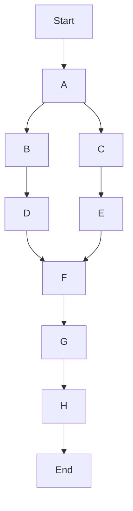

## Exercice Résolu : Planification de Projet (WBS et Chemin Critique)

**Contexte :** Vous êtes chef de projet pour le développement d'un module de gestion des utilisateurs pour une application web. Voici les tâches identifiées, leurs durées estimées et leurs dépendances :

| Tâche | Description | Durée (jours) | Prérequis |
| :---- | :---------- | :------------ | :-------- |
| A     | Analyse des besoins | 5             | -         |
| B     | Conception de la base de données | 4             | A         |
| C     | Conception de l'interface utilisateur | 6             | A         |
| D     | Développement du backend (API) | 8             | B         |
| E     | Développement du frontend (UI) | 7             | C         |
| F     | Intégration backend/frontend | 3             | D, E      |
| G     | Tests unitaires et d'intégration | 5             | F         |
| H     | Déploiement et mise en production | 2             | G         |

**Questions :**
1.  Dessinez un diagramme PERT simplifié pour ce projet.
2.  Calculez les dates au plus tôt (début et fin) et au plus tard (début et fin) pour chaque tâche.
3.  Identifiez le chemin critique et la durée totale du projet.

---

### Solution Détaillée

#### 1. Diagramme PERT simplifié
(Représentation textuelle, en examen, un dessin est attendu)

#### 2. Calcul des dates au plus tôt (ES, EF) et au plus tard (LS, LF)

*   **ES (Earliest Start) :** Date de début au plus tôt.
*   **EF (Earliest Finish) :** Date de fin au plus tôt (ES + Durée).
*   **LS (Latest Start) :** Date de début au plus tard.
*   **LF (Latest Finish) :** Date de fin au plus tard (LS + Durée).
*   **Marge Totale (Slack) :** LF - EF ou LS - ES. Tâches critiques ont une marge de 0.

**Passage avant (calcul ES, EF) :**

| Tâche | Durée | Prérequis | ES | EF (ES + Durée) |
| :---- | :---- | :-------- | :- | :-------------- |
| A     | 5     | -         | 0  | 5               |
| B     | 4     | A         | 5  | 9               |
| C     | 6     | A         | 5  | 11              |
| D     | 8     | B         | 9  | 17              |
| E     | 7     | C         | 11 | 18              |
| F     | 3     | D, E      | 18 | 21              |
| G     | 5     | F         | 21 | 26              |
| H     | 2     | G         | 26 | 28              |

**Durée totale du projet = 28 jours.**

**Passage arrière (calcul LS, LF) :**
On commence par la dernière tâche (H) où LF = EF du projet = 28.

| Tâche | Durée | EF | LF (LS + Durée) | LS (LF - Durée) | Marge (LF - EF) |
| :---- | :---- | :- | :-------------- | :-------------- | :-------------- |
| H     | 2     | 28 | 28              | 26              | 0               |
| G     | 5     | 26 | 26              | 21              | 0               |
| F     | 3     | 21 | 21              | 18              | 0               |
| E     | 7     | 18 | 18              | 11              | 0               |
| D     | 8     | 17 | 18              | 10              | 1               |
| C     | 6     | 11 | 11              | 5               | 0               |
| B     | 4     | 9  | 10              | 6               | 1               |
| A     | 5     | 5  | 5               | 0               | 0               |

#### 3. Identification du chemin critique et durée totale

Le **chemin critique** est la séquence de tâches avec une marge totale de 0. Ces tâches ne peuvent pas être retardées sans retarder l'ensemble du projet.

Dans cet exemple, les tâches critiques sont : **A -> C -> E -> F -> G -> H**.

La **durée totale du projet** est de **28 jours**.

**Vérification du chemin critique :**
Durée A (5) + Durée C (6) + Durée E (7) + Durée F (3) + Durée G (5) + Durée H (2) = 5 + 6 + 7 + 3 + 5 + 2 = **28 jours**.

Le chemin A -> B -> D -> F -> G -> H a une durée de 5 + 4 + 8 + 3 + 5 + 2 = 27 jours, ce qui est plus court. Donc le chemin critique est bien A-C-E-F-G-H.